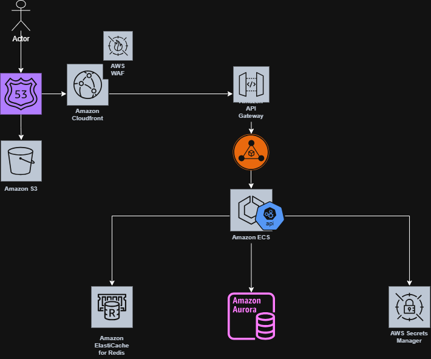

# Clientes API

API REST desenvolvida em **.NET** para gerenciamento de clientes com operações bancárias básicas como cadastro, depósito, saque e exclusão.

O projeto foi desenvolvido seguindo boas práticas de arquitetura e inclui **testes unitários** para garantir a confiabilidade das regras de negócio.

A API foi evoluída para suportar:
- autenticação via **JWT**
- controle de acesso por perfil (**User** e **Admin**)
- visualização restrita da própria conta para usuários comuns
- visualização completa de todas as contas para administradores

---

# 🚀 Tecnologias utilizadas

* .NET 8
* ASP.NET Core Web API
* Entity Framework Core
* SQLite
* xUnit (Testes Unitários)
* Moq (Mocks para testes)
* Swagger / OpenAPI

---

## 🔐 Perfis de Acesso

### User
Usuário padrão do sistema. Pode:
- fazer login
- visualizar apenas a própria conta
- realizar depósito e saque apenas na própria conta
- atualizar e excluir apenas a própria conta

### Admin
Usuário administrador. Pode:
- visualizar todas as contas
- consultar qualquer cliente
- realizar operações em qualquer conta
- cadastrar novos clientes
- excluir clientes

---

# 📁 Estrutura do projeto

```
Clientes.Api
├── Application
│   ├── DTOs
│   └── Services
├── Controllers
├── Domain
│   └── Entities
├── Infrastructure
│   ├── Data
│   └── Repositories
├── Middleware
├── Program.cs
└── appsettings.json
```

---

## 👤 Entidade Principal

### Cliente

Representa um cliente da aplicação com os seguintes campos:

- Id
- Nome
- Email
- Senha
- Saldo
- Role

Também contém regras de negócio para:

- validar senha
- atualizar dados
- depositar
- sacar

---

## Autenticação

A autenticação é feita por **JWT**.

Após login bem-sucedido, a API retorna:

- token
- id do usuário
- nome
- email
- role

### Exemplo de resposta de login

```json
{
  "token": "jwt-token",
  "id": 1,
  "nome": "Maria",
  "email": "maria@email.com",
  "role": "User"
}
```


## Claims utilizadas no token
* NameIdentifier

* Name

* Email

* Role

## Configuração JWT

A configuração fica no arquivo `appsettings.json`.

```json
"Jwt": {
  "Key": "uma-chave-super-secreta-com-no-minimo-32-caracteres",
  "Issuer": "ClientesApi",
  "Audience": "ClientesWeb"
}
```


## 🌐 Endpoints Principais
## Auth

`POST /auth/login`

Realiza login do usuário.

Request
```json
{
  "email": "maria@email.com",
  "senha": "123456"
}
```

## Clientes
`POST /clientes`

Cria um novo cliente.


## GET /clientes

Lista todos os clientes.

Acesso: Admin

## GET /clientes/me

Retorna os dados do usuário autenticado.

Acesso: User e Admin

## GET /clientes/{id}

Retorna dados de um cliente específico.

Acesso: Admin ou dono da conta

## PUT /clientes/{id}

Atualiza dados do cliente.

Acesso: Admin ou dono da conta

## DELETE /clientes/{id}

Exclui cliente.

Acesso: Admin ou dono da conta

## POST /clientes/{id}/depositar

Realiza depósito.

Acesso: Admin ou dono da conta

Request
```json
{
  "valor": 100
  
}
```

## POST /clientes/{id}/sacar

Realiza saque.

Acesso: Admin ou dono da conta

Request

```json
{
  "valor": 50
}
```


## Regras de Negócio

* saldo inicial do cliente é 0

* depósito deve ser maior que zero

* saque deve ser maior que zero

* não é permitido sacar valor maior que o saldo disponível

* usuários comuns só podem acessar a própria conta

* administradores podem acessar qualquer conta


## 💾 Banco de Dados

A aplicação utiliza SQLite.

Connection String


```json
"ConnectionStrings": {
  "DefaultConnection": "Data Source=clientes.db"
}
```

## ⚙️ Como Executar o Projeto

Pré-requisitos

* .NET 8 SDK instalado


### Passos para execução:
```bash
dotnet restore
dotnet run
```
A API ficará disponível em uma URL local, por exemplo:

`http://localhost:5000`

### Swagger
A documentação interativa da API pode ser acessada em:
`http://localhost:5000/swagger`

### Como Testar no Swagger

1. Criar um usuário em:
`POST /clientes`

2. Fazer login em:
`POST /auth/login`

3. Copiar o token retornado

4. Clicar no botão Authorize

5. Informar:
`Bearer seu_token_aqui`

6. Testar endpoints protegidos

## 🧪 Testes Unitários

* regras da entidade Cliente

* lógica do ClienteService

* autenticação no AuthController

* regras de autorização no ClientesController

## Executar testes
```bash
dotnet test
```

## Executar testes com cobertura

```bash
dotnet test --collect:"XPlat Code Coverage"
```


## Tratamento de Exceções
A API possui um middleware global de exceções responsável por capturar erros da aplicação e retornar respostas padronizadas contendo:

* mensagem

* status HTTP

<br>
<br>
<br>

# 🏗️ Arquitetura da Solução





A arquitetura foi projetada para suportar alta disponibilidade, escalabilidade e segurança, utilizando serviços gerenciados da AWS.
Ela segue uma abordagem em camadas, separando edge, frontend, backend e dados.

O fluxo geral da aplicação é:

`Usuário → Route53 → CloudFront + WAF → API Gateway → ALB → ECS → Banco e serviços auxiliares`

# 🌐 Camada de Entrada (Edge Layer)
### 👤 Usuário

Representa o cliente que acessa a aplicação por meio de um navegador ou dispositivo móvel.

O usuário pode acessar:

* a aplicação web Angular

* os endpoints da API

### 🌍 Amazon Route 53

O Route 53 é o serviço de DNS da AWS.

**Responsabilidades**

* Resolver o domínio da aplicação

* Direcionar o tráfego para o CloudFront

* Gerenciar registros DNS

**Benefícios**

* alta disponibilidade

* baixa latência

* integração com outros serviços AWS

### ☁️ Amazon CloudFront

O CloudFront é uma CDN (Content Delivery Network).

**Responsabilidades**

* distribuir conteúdo estático globalmente

* reduzir latência

* cachear recursos do frontend

**No projeto**

Ele distribui:

`Frontend Angular hospedado no S3`
### 🛡️ AWS WAF

O Web Application Firewall protege a aplicação contra ataques comuns.

**Proteções**

* SQL Injection

* Cross-Site Scripting (XSS)

* bots maliciosos

* ataques DDoS de camada de aplicação

Ele fica entre o CloudFront e os serviços internos.

# 🎨 Camada de Frontend: 
### 🪣 Amazon S3

O Amazon S3 hospeda a aplicação Angular como site estático.

**Responsabilidades**

* armazenar arquivos estáticos

* servir a aplicação web

Exemplos de arquivos:

```bash
index.html
main.js
styles.css
assets

```
**Benefícios**

* custo baixo

* alta disponibilidade

* integração com CloudFront

# 🚪 Camada de API
### 🔗 Amazon API Gateway

O API Gateway é responsável por expor os endpoints da API.

**Responsabilidades**

* gerenciar rotas da API

* autenticação

* rate limiting

* controle de acesso

* versionamento

**Benefícios**

* proteção adicional da API

* gerenciamento centralizado

### ⚖️ Application Load Balancer (ALB)

O Application Load Balancer distribui as requisições entre os containers da aplicação.

**Responsabilidades**

* balancear carga entre containers

* detectar instâncias saudáveis

* rotear requisições HTTP/HTTPS

**Benefícios**

* alta disponibilidade

* escalabilidade automática

# ⚙️ Camada de Aplicação
### 🐳 Amazon ECS (Fargate)

O Amazon ECS com Fargate executa os serviços da aplicação em containers.

**Serviços executados**

* Auth API

* Clientes API

* Transações API

* Notificações API

**Responsabilidades**

* executar lógica de negócio

* processar requisições da API

* aplicar regras de domínio

* acessar banco de dados

**Benefícios**

* escalabilidade horizontal

* não exige gerenciamento de servidores

* integração com CI/CD

# ⚡ Camada de Performance
### 🚀 Amazon ElastiCache (Redis)

O Redis é utilizado como camada de cache.

**Responsabilidades**

* cache de consultas frequentes

* reduzir carga no banco

* melhorar tempo de resposta

**Exemplos de uso**

* dados de clientes frequentemente consultados

* sessões temporárias

* tokens ou rate limit

# 🗄️ Camada de Dados
### 🐘 Amazon Aurora PostgreSQL Serverless v2

O Aurora PostgreSQL é o banco de dados principal da aplicação.

**Responsabilidades**

* armazenar dados de clientes

* registrar transações

* manter integridade dos dados

**Recursos importantes**

* escalabilidade automática

* Multi-AZ

* failover automático

* alta disponibilidade

**Read Replicas**

As réplicas de leitura permitem:

* distribuir consultas

* reduzir carga do banco principal

* melhorar performance

## 🔐 Gerenciamento de Segredos
# 🔑 AWS Secrets Manager

Responsável por armazenar credenciais sensíveis.

**Exemplos**

* senha do banco

* chaves de API

* tokens

**Benefícios**

* rotação automática de credenciais

* segurança

* integração com ECS

# 📊 Benefícios da Arquitetura

Essa arquitetura oferece:

**Escalabilidade**

Serviços podem escalar horizontalmente.

**Resiliência**

Falhas em um serviço não derrubam todo o sistema.

**Segurança**

Camadas de proteção como:

* WAF

* Secrets Manager

* IAM

**Performance**

Uso de:

* CDN

* Cache Redis

* Load Balancer


### 🚀 Resultado

Essa arquitetura permite que a aplicação suporte:

`~5000 usuários simultâneos`

com:

* alta disponibilidade

* baixa latência

* capacidade de crescimento

<br>
<br>
<br>

**Repositório front end**
`https://github.com/Yhuri-Gross/case_itau_front`